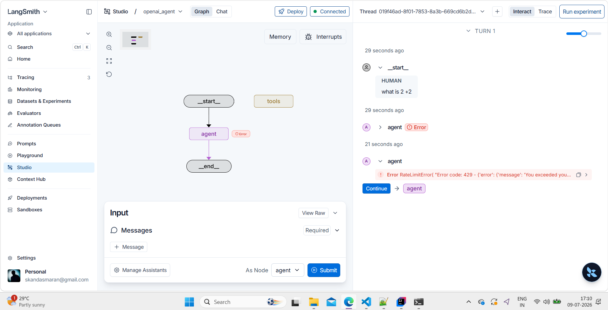

# RAG - Ultimate

RAG - Ultimate is a repository for building and experimenting with Retrieval-Augmented Generation solutions. It combines retrieval mechanisms with generative models to enhance information relevance and response quality.

## Features

- Retrieval of relevant documents or data
- Integration with generative models
- Support for custom data sources
- Modular architecture for experimentation and extension

## Getting Started

1. Clone the repository:
   git clone https://github.com/skanda2271/RAG---Ultimate.git
2. Navigate to the project directory:
   cd RAG---Ultimate
3. Install dependencies if applicable:
   pip install -r requirements.txt

## Usage

- Review available scripts or notebooks in the repository.
- Configure data sources and model settings before running experiments.
- Use the provided examples to test retrieval and generation workflows.

## Contributing

- Fork the repository
- Create a new branch
- Submit a pull request with improvements or bug fixes

## License

Refer to the repository license file for details.

